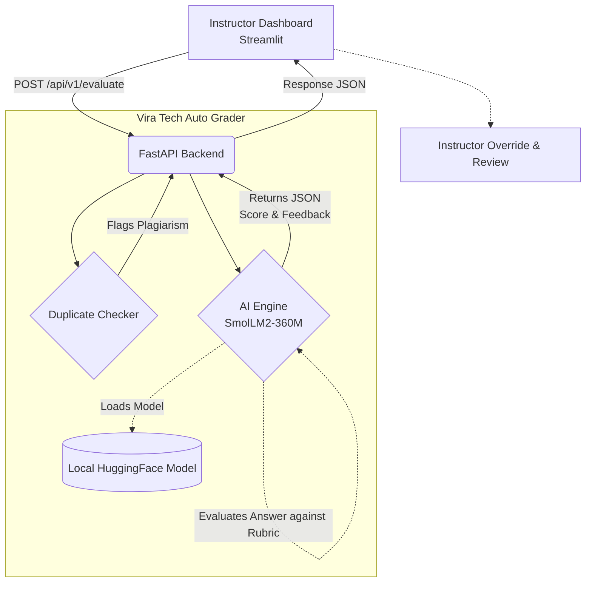

# System Architecture

Below is the architecture diagram showing how the data flows from the Instructor Dashboard through the Backend API and into the AI evaluation modules.

## Architecture Diagram (Mermaid)

You can copy the code below and paste it into [Mermaid Live Editor](https://mermaid.live/) to generate a PNG/PDF diagram.

## Workflow Explanation:
1. **Answer Ingestion:** The instructor or student submits the answer via the Streamlit dashboard.
2. **API Layer:** FastAPI receives the payload (`submission_id`, `question_id`, `answer_text`, `rubric_id`).
3. **Plagiarism Check:** Before grading, the `DuplicateChecker` verifies if the answer is copied.
4. **AI Evaluation:** The `AIEngine` loads the local `SmolLM2` model, compares the answer against the rubric, and generates a score and feedback.
5. **Dashboard Review:** The structured JSON response is sent back to the dashboard, where the instructor can review the AI's feedback and override the score if necessary.
